# Rendering three-dimensional points on a two-dimensional plane

We will need to create an "eye", or camera, and a plane in front of the camera (a "window"). For every point we want to draw, we need to find the point of intersection between the plane and the line between the camera and point. Here is an illustration of this:

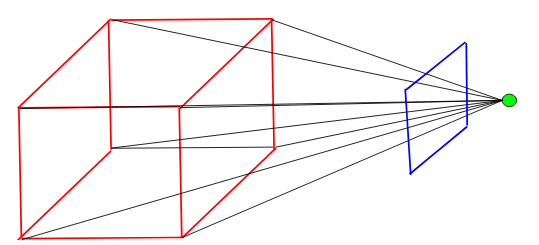

In this diagram, the red lines are what we want to draw, the blue square is the plane in front of the camera (what the user will see), and the green circle is the camera. The camera should be able to rotate about the origin in a sphere.

The first thing we need to do is calculate the camera position, given a horizontal rotation and elevation; this just uses basic trigonometry.

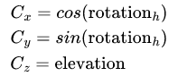

Since the plane is perpendicular to the line between the camera and the origin, the camera's position is also the plane's normal vector. To define the plane, we also need a point on the plane; to find this, we will multiply the camera's position by a constant (the field of view). I set this constant to 0.75, so the plane is three-quarters of the way between the origin and camera. I will use the variable Q to represent this point.

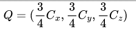

The scalar equation of a plane is defined as

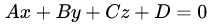

Where A, B, and C are the coefficients of the normal vector (C). To find the D-value, we can substitute the point Q for x, y, and z:

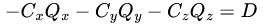

We can now find the equation of the line between the point we want to render (which we will define as P) and the camera's position. For convenience, we will define the movement vector between the point and camera as M.

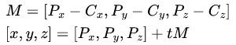

## Finding the collision of the line and plane

Typically, when we want to find the intersection of a plane and a line, we take the parametric equations of the line and substitute them into the plane's equation. From the equation of our line, we can find the parametric equations

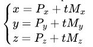

Substituting each of these into the plane equation and solving for t gives

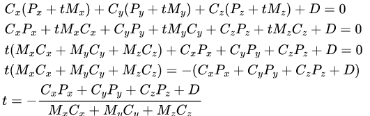

Since all variables on the right side of the equation are constants, we can calculate the value of t. To find the point of intersection between the line and plane, we can put t back into the parametric equations.

## Creating unit vectors parallel to the plane

Now we know the POI (which we will call I); to figure out where to render this on the screen, we'll need to create unit vectors (let's call them X and Y) that are parallel to the plane and perpendicular to each other. To ensure that the rendering is consistent no matter the angle, the X unit vector should also intersect with the Z-axis at some point. To be parallel to the plane, it must be perpendicular to the plane's normal vector, so the dot product must be zero. Using these two conditions, we can form these equations:

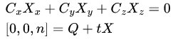

In the second equation, n can be any real value. From the second equation, we can derive the parametric equations

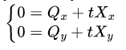

Solving for t:

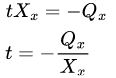

And substituting into the second equation and solving for Xx:

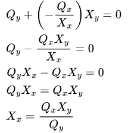

We can now put this into the dot product equation from above, and solve for Xy:

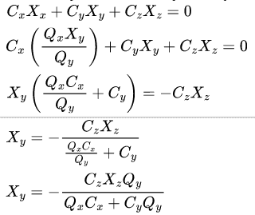

We can assume that Xz is equal to 1, which simplifies to

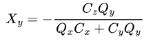

Substituting this back into our equation for Xx and simplifying:

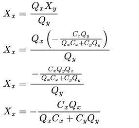

Therefore, our first unit vector has the coordinates

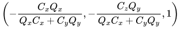

For our second unit vector, we want a vector that is perpendicular to both the first unit vector and the plane's normal vector. For this, we can use the cross product:

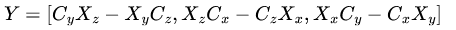

Now, to turn these into true unit vectors, we must give them a magnitude of 1 by dividing each coordinate by the vector's magnitude:

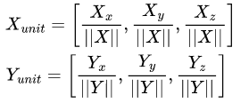

(from now on, we will refer to Xunit and Yunit as X and Y respectively.)

## Finding the positions to render

We can now find the x and y coordinates (which we will refer to as s and t) to render the point at using multiples of these unit vectors:

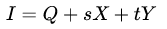

From which we derive the equations

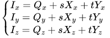

We can take the first equation and solve for s:

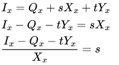

We can substitute this into the second equation:

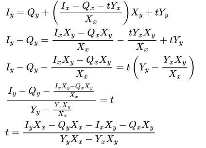

We can now compute the values of t and s. These are the final positions at which the point will be rendered, but they are quite small values, so we will multiply each by 100.

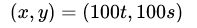
